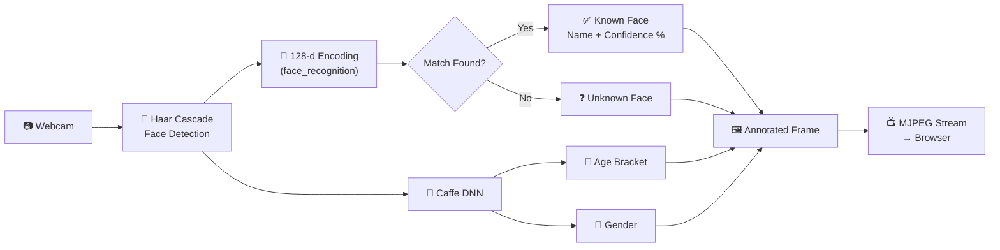

<div align="center">

# 👁️ FaceVision AI

### _Real-Time Face Recognition • Age Estimation • Gender Detection_

[](https://python.org)
[](https://flask.palletsprojects.com/)
[](https://opencv.org/)
[](http://dlib.net/)
[](#-license)

<br/>

```
    ╔═══════════════════════════════════════════════════════════╗
    ║                                                           ║
    ║         ███████╗ █████╗  ██████╗███████╗                  ║
    ║         ██╔════╝██╔══██╗██╔════╝██╔════╝                  ║
    ║         █████╗  ███████║██║     █████╗                    ║
    ║         ██╔══╝  ██╔══██║██║     ██╔══╝                    ║
    ║         ██║     ██║  ██║╚██████╗███████╗                  ║
    ║         ╚═╝     ╚═╝  ╚═╝ ╚═════╝╚══════╝                  ║
    ║                                                           ║
    ║         ██╗   ██╗██╗███████╗██╗ ██████╗ ███╗   ██╗        ║
    ║         ██║   ██║██║██╔════╝██║██╔═══██╗████╗  ██║        ║
    ║         ██║   ██║██║███████╗██║██║   ██║██╔██╗ ██║        ║
    ║          ╚██╗██╔╝██║╚════██║██║██║   ██║██║╚██╗██║        ║
    ║           ╚███╔╝ ██║███████║██║╚██████╔╝██║ ╚████║        ║
    ║            ╚══╝  ╚═╝╚══════╝╚═╝ ╚═════╝ ╚═╝  ╚═══╝        ║
    ║                                                           ║
    ║              🤖 AI-Powered Face Analysis                   ║
    ╚═══════════════════════════════════════════════════════════╝
```

<br/>

> 🎥 A **real-time face recognition web application** that detects faces via your webcam, identifies registered individuals with **128-dimensional face encodings**, and estimates **age & gender** using deep learning Caffe models — all streamed live through a premium glassmorphism UI.

---

[Features](#-features) •
[How It Works](#-how-it-works) •
[Tech Stack](#-tech-stack) •
[Setup](#-quick-start) •
[API Reference](#-api-endpoints) •
[Architecture](#-system-architecture) •
[Project Structure](#-project-structure)

</div>

---

## ✨ Features

<table>
<tr>
<td width="50%">

### 🔍 Face Detection & Recognition
- **Real-time detection** using OpenCV Haar Cascades
- **128-dimensional face encoding** via dlib for recognition
- **Confidence scoring** — shows match percentage
- Thread-safe **pickle database** for face storage
- Register faces via **photo upload** or **webcam capture**

### 🎂 Age Estimation
- **8 age brackets**: (0-2), (4-6), (8-12), (15-20), (25-32), (38-43), (48-53), (60-100)
- Powered by **Caffe DNN** pre-trained models
- Real-time overlay on detected faces

</td>
<td width="50%">

### 🚻 Gender Detection
- Binary classification: **Male / Female**
- Caffe DNN model with mean subtraction
- Displayed alongside age below bounding boxes

### 🎨 Premium Web Interface
- **Glassmorphism** dark UI design
- **MJPEG live streaming** — zero-latency video feed
- **Live stats panel** — face count, identities, age/gender
- Face **registration & removal** from the browser
- Fully responsive HTML5/CSS3/JS frontend

</td>
</tr>
</table>

---

## 🧠 How It Works



### Pipeline Breakdown

| Step | Component | Technology | What Happens |
|:---:|:---|:---|:---|
| 1️⃣ | **Capture** | OpenCV `VideoCapture` | Webcam frames captured in a background thread |
| 2️⃣ | **Detect** | Haar Cascade Classifier | Fast CPU-based face localization (bounding boxes) |
| 3️⃣ | **Encode** | `face_recognition` (dlib) | Extract 128-dimensional face descriptor vector |
| 4️⃣ | **Match** | Euclidean Distance | Compare encoding against known faces database |
| 5️⃣ | **Analyze** | Caffe DNN Models | Estimate age bracket and gender |
| 6️⃣ | **Render** | OpenCV Drawing | Overlay bounding boxes, labels, and confidence |
| 7️⃣ | **Stream** | Flask MJPEG | Push annotated frames to browser in real-time |

---

## 🛠️ Tech Stack

<div align="center">

| Layer | Technology | Purpose |
|:---|:---|:---|
| 🌐 **Web Server** | Flask 3.x | REST API + MJPEG video streaming |
| 📷 **Face Detection** | OpenCV Haar Cascades | Fast, CPU-friendly face localization |
| 🧬 **Face Recognition** | `face_recognition` (dlib) | 128-d encoding + Euclidean distance matching |
| 🎂 **Age Estimation** | OpenCV DNN (Caffe) | `age_net.caffemodel` — 8-bracket classification |
| 🚻 **Gender Detection** | OpenCV DNN (Caffe) | `gender_net.caffemodel` — binary classification |
| 💾 **Face Database** | Python `pickle` | Persistent storage of names + encodings |
| 🎨 **Frontend** | HTML5, CSS3, Vanilla JS | Glassmorphism dark UI with live stats |
| 📦 **Build Tools** | cmake, dlib | Required for face_recognition compilation |

</div>

---

## 🚀 Quick Start

### Prerequisites

| Requirement | Why |
|:---|:---|
| **Python 3.10+** | Core runtime |
| **Webcam** | Real-time face capture |
| **cmake** | Required to compile dlib |
| **Visual Studio Build Tools** *(Windows only)* | C++ workload needed for dlib compilation |

### Installation

```bash
# 1️⃣ Clone the repository
git clone https://github.com/hussnainahmedd/FaceVision-AI.git
cd FaceVision-AI

# 2️⃣ Create & activate virtual environment
python -m venv venv

# Windows
venv\Scripts\activate
# macOS/Linux
source venv/bin/activate

# 3️⃣ Install dependencies
pip install -r requirements.txt

# 4️⃣ Download AI models (age/gender Caffe models)
python download_models.py

# 5️⃣ Launch the application
python app.py
```

**6️⃣ Open your browser** → **http://localhost:5000** 🎉

> [!IMPORTANT]
> **Windows users**: You must install [Visual Studio Build Tools](https://visualstudio.microsoft.com/visual-cpp-build-tools/) with the **"Desktop development with C++"** workload before `pip install dlib` will succeed.

> [!TIP]
> The `download_models.py` script automatically fetches the age and gender Caffe models (~44MB) from the official [AgeGenderDeepLearning](https://github.com/GilLevi/AgeGenderDeepLearning) repository.

---

## 📡 API Endpoints

| Method | Endpoint | Description | Request |
|:---:|:---|:---|:---|
| `GET` | `/` | Serve the main UI page | — |
| `GET` | `/video_feed` | MJPEG live video stream | Use as `` |
| `POST` | `/register_face` | Register a new face | `multipart/form-data`: `name` (text) + `image` (file) |
| `DELETE` | `/remove_face` | Remove a registered face | JSON: `{"name": "..."}` |
| `GET` | `/stats` | Get live detection statistics | Returns JSON with face count & details |
| `GET` | `/known_faces` | List all registered faces | Returns JSON array of names |

### Example: Register a Face

```bash
curl -X POST http://localhost:5000/register_face \
  -F "name=Hussnain" \
  -F "image=@photo.jpg"
```

```json
{ "success": true, "message": "Face 'Hussnain' registered successfully." }
```

---

## 🏗️ System Architecture

```
┌──────────────────────────────────────────────────────────────────┐
│                       FaceVision AI System                        │
├──────────────────────────────────────────────────────────────────┤
│                                                                  │
│  ┌──────────────┐      ┌───────────────────────────────────┐    │
│  │  🌐 Flask     │      │         📷 Camera Module           │    │
│  │  Web Server   │      │         (Singleton Pattern)        │    │
│  │              │      │                                   │    │
│  │ GET /        │      │  ┌─────────────────────────────┐  │    │
│  │ GET /video   │◄─────│  │  Background Capture Thread  │  │    │
│  │ POST /reg.   │      │  │  • cv2.VideoCapture(0)      │  │    │
│  │ DEL /remove  │      │  │  • threading.Lock()         │  │    │
│  │ GET /stats   │      │  └──────────┬──────────────────┘  │    │
│  └──────┬───────┘      │             │                      │    │
│         │              │  ┌──────────▼──────────────────┐  │    │
│         │              │  │  Face Processing Thread     │  │    │
│  ┌──────▼───────┐      │  │                             │  │    │
│  │  🎨 Frontend │      │  │  1. Haar Cascade Detection  │  │    │
│  │              │      │  │  2. face_recognition encode │  │    │
│  │ • index.html │      │  │  3. Database matching       │  │    │
│  │ • style.css  │      │  │  4. Caffe DNN age/gender    │  │    │
│  │ • app.js     │      │  │  5. Draw annotations        │  │    │
│  │              │      │  └──────────┬──────────────────┘  │    │
│  │ Glassmorphism│      │             │                      │    │
│  │ Dark Theme   │      │  ┌──────────▼──────────────────┐  │    │
│  └──────────────┘      │  │  MJPEG Frame Generator      │  │    │
│                         │  │  • multipart/x-mixed-replace│  │    │
│                         │  └─────────────────────────────┘  │    │
│                         └───────────────────────────────────┘    │
│                                                                  │
│  ┌──────────────────────┐    ┌────────────────────────────┐     │
│  │  🧬 Face Manager      │    │  🧠 DNN Models              │     │
│  │                      │    │                            │     │
│  │  • Register face     │    │  • age_deploy.prototxt     │     │
│  │  • Remove face       │    │  • age_net.caffemodel      │     │
│  │  • Match encoding    │    │  • gender_deploy.prototxt  │     │
│  │  • Pickle database   │    │  • gender_net.caffemodel   │     │
│  │  • Thread-safe lock  │    │                            │     │
│  └──────────────────────┘    └────────────────────────────┘     │
│                                                                  │
└──────────────────────────────────────────────────────────────────┘
```

---

## 🧬 Deep Learning Models

### Age Estimation Model
| Property | Value |
|:---|:---|
| **Architecture** | CaffeNet (AlexNet variant) |
| **Input Size** | 227 × 227 × 3 |
| **Output** | 8 age brackets |
| **Mean Subtraction** | `(78.43, 87.77, 114.90)` |
| **Brackets** | `(0-2)`, `(4-6)`, `(8-12)`, `(15-20)`, `(25-32)`, `(38-43)`, `(48-53)`, `(60-100)` |
| **Source** | [Levi & Hassner, 2015](https://github.com/GilLevi/AgeGenderDeepLearning) |

### Gender Detection Model
| Property | Value |
|:---|:---|
| **Architecture** | CaffeNet (AlexNet variant) |
| **Input Size** | 227 × 227 × 3 |
| **Output** | 2 classes: Male, Female |
| **Mean Subtraction** | `(78.43, 87.77, 114.90)` |
| **Source** | [Levi & Hassner, 2015](https://github.com/GilLevi/AgeGenderDeepLearning) |

### Face Recognition
| Property | Value |
|:---|:---|
| **Library** | `face_recognition` (wraps dlib) |
| **Encoding** | 128-dimensional face descriptor |
| **Matching** | Euclidean distance (threshold-based) |
| **Detection** | Haar Cascade (fast, CPU-friendly) |

---

## 📂 Project Structure

```
FaceVision-AI/
│
├── app.py                      # 🌐 Flask web server — REST API routes,
│                               #    MJPEG video streaming, face registration
│
├── camera.py                   # 📷 Camera module (Singleton) — webcam capture,
│                               #    Haar cascade detection, face_recognition encoding,
│                               #    Caffe DNN age/gender estimation, frame annotation
│
├── face_manager.py             # 🧬 Face database manager — thread-safe pickle storage,
│                               #    register/remove/match face encodings
│
├── download_models.py          # ⬇️ Auto-downloads Caffe age/gender models from GitHub
│
├── requirements.txt            # 📦 Python dependencies (cmake, dlib, face_recognition,
│                               #    opencv-python, flask, numpy)
│
├── .gitignore                  # 🚫 Ignore rules for models, uploads, cache
│
├── models/                     # 🧠 Pre-trained Caffe DNN models
│   ├── age_deploy.prototxt     #    Age model architecture definition
│   ├── age_net.caffemodel      #    Age model weights (downloaded)
│   ├── gender_deploy.prototxt  #    Gender model architecture definition
│   └── gender_net.caffemodel   #    Gender model weights (downloaded)
│
├── templates/                  # 🎨 Flask HTML templates
│   └── index.html              #    Main UI page with glassmorphism design
│
├── static/                     # 📁 Static frontend assets
│   ├── css/                    #    Stylesheets (dark theme, glassmorphism)
│   └── js/                     #    JavaScript (live stats, face registration)
│
├── known_faces/                # 📸 Registered face images (created at runtime)
├── uploads/                    # 📤 Temporary upload directory (created at runtime)
└── known_faces.pkl             # 💾 Face encoding database (created at runtime)
```

---

## 🔑 Design Patterns

| Pattern | Where | Why |
|:---|:---|:---|
| **Singleton** | `Camera` class | Only one webcam instance across the entire app |
| **Thread Safety** | `FaceManager`, `Camera` | `threading.Lock()` prevents race conditions on shared data |
| **Producer-Consumer** | Capture → Process → Stream | Background threads capture frames; processing and streaming are decoupled |
| **Generator** | `generate_frames()` | Python generator yields MJPEG frames lazily for Flask streaming |
| **Repository** | `FaceManager` | Abstracts pickle database behind clean register/remove/match API |

---

## 🎯 Use Cases

- 🏢 **Office Attendance** — Automatically log employees as they walk past a webcam
- 🔒 **Security Systems** — Real-time identification of known vs unknown individuals
- 🎓 **Academic Projects** — Learn face recognition, deep learning, and web streaming
- 🏪 **Retail Analytics** — Estimate customer demographics (age/gender)
- 🏠 **Smart Home** — Personalized greetings based on who enters

---

## 🤝 Contributing

1. **Fork** the repository
2. **Create** a feature branch (`git checkout -b feature/amazing-feature`)
3. **Commit** your changes (`git commit -m '✨ Add amazing feature'`)
4. **Push** to the branch (`git push origin feature/amazing-feature`)
5. **Open** a Pull Request

---

## 📜 License

This project is open source and available under the [MIT License](LICENSE).

---

<div align="center">

**⭐ Star this repo if FaceVision AI impressed you!**

<br/>

_Detecting faces, estimating ages, identifying identities — all in real-time._

<br/>

Built with 🐍 Python · 📷 OpenCV · 🧬 dlib · 🌐 Flask

</div>
