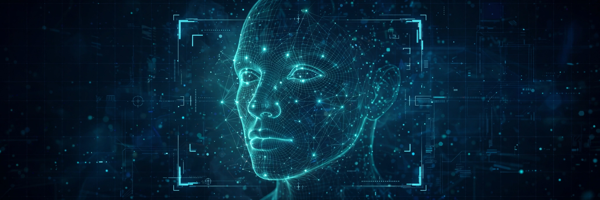

<div align="center">

# 👁️ FaceVision AI

### Real-time face recognition, age estimation & gender detection — streamed live to your browser

[](https://www.python.org/)
[](https://flask.palletsprojects.com/)
[](https://opencv.org/)
[](http://dlib.net/)

</div>

---

I built this to learn real-time computer vision hands-on: point your webcam at the app and it **detects faces**, **recognizes registered people** using 128-dimensional face encodings, and **estimates age & gender** with pre-trained deep-learning models — all annotated and streamed live to a dark glassmorphism web UI over MJPEG.

## ✨ Features

- **Real-time face detection** with OpenCV Haar cascades, captured on a decoupled background thread
- **Face recognition** via 128-d encodings (`face_recognition` / dlib), matched by Euclidean distance with a confidence score on every box
- **Age estimation** — 8 brackets `(0-2)` → `(60-100)` using a pre-trained Caffe model
- **Gender detection** — Male / Female classification through the same Caffe DNN pipeline
- **Register faces from the browser** — photo upload (`POST /register_face`) or direct webcam capture (`POST /register_webcam`)
- **Thread-safe face database** — encodings persisted in `known_faces.pkl`, source photos kept in `known_faces/`
- **REST API** — `GET /api/faces`, `DELETE /api/faces/<name>`, live detections at `GET /api/stats`, per-face thumbnails
- **Zero-latency MJPEG stream** — annotated frames pushed straight to an `` tag at `/video_feed`

## 🛠️ Tech Stack

| Layer | Technology |
|---|---|
| Web server | Flask — REST API + MJPEG streaming (`app.py`) |
| Face detection | OpenCV Haar cascades |
| Face recognition | `face_recognition` (dlib) — 128-d encodings |
| Age / gender | OpenCV DNN + Caffe models (Levi & Hassner, 2015) |
| Storage | Python `pickle` behind a thread-safe `FaceManager` |
| Camera | Singleton `Camera` class — capture, detect, annotate, stream |
| Frontend | HTML5, CSS3, vanilla JS — dark glassmorphism UI |

## 🚀 Run it

```bash
# 1. Clone
git clone https://github.com/hussnainahmedd/FaceVision-AI.git
cd FaceVision-AI

# 2. Virtual environment
python -m venv venv
source venv/bin/activate        # Windows: venv\Scripts\activate

# 3. Install dependencies
pip install -r requirements.txt

# 4. Download the age/gender Caffe models
python download_models.py

# 5. Launch
python app.py
```

Then open **http://localhost:5000** 🎥

> [!NOTE]
> `requirements.txt` includes `cmake` and `dlib`, which compile from source — on Windows you'll need the [C++ build tools](https://visualstudio.microsoft.com/visual-cpp-build-tools/) installed first. The `download_models.py` script fetches the Caffe weights from the official [AgeGenderDeepLearning](https://github.com/GilLevi/AgeGenderDeepLearning) repo (~200MB).

## 📡 API Endpoints

| Method | Endpoint | Description |
|:---:|:---|:---|
| `GET` | `/` | Main UI page |
| `GET` | `/video_feed` | MJPEG live video stream (use as ``) |
| `POST` | `/register_face` | Register a face — `multipart/form-data`: `name` + `image` |
| `POST` | `/register_webcam` | Register the face currently in front of the webcam |
| `GET` | `/api/faces` | List all registered faces |
| `DELETE` | `/api/faces/<name>` | Remove a registered face |
| `GET` | `/api/faces/<name>/thumbnail` | Face thumbnail image |
| `GET` | `/api/stats` | Live detection stats (face count, details) |

## 📂 Project Structure

```
FaceVision-AI/
├── app.py              # Flask server — routes, MJPEG streaming, registration
├── camera.py           # Camera singleton — capture, detect, encode, annotate
├── face_manager.py     # Thread-safe pickle face database (register/remove/match)
├── download_models.py  # Fetches the Caffe age/gender models once
├── requirements.txt    # cmake, dlib, face_recognition, opencv-python, flask, numpy
├── models/             # age/gender Caffe prototxt + weights
├── templates/          # index.html
└── static/             # css/ + js/ for the UI
```

## 🖼️ Preview



---

<div align="center">

Built by [Hussnain Ahmad](https://github.com/hussnainahmedd) — a CS undergrad learning by building.

</div>
